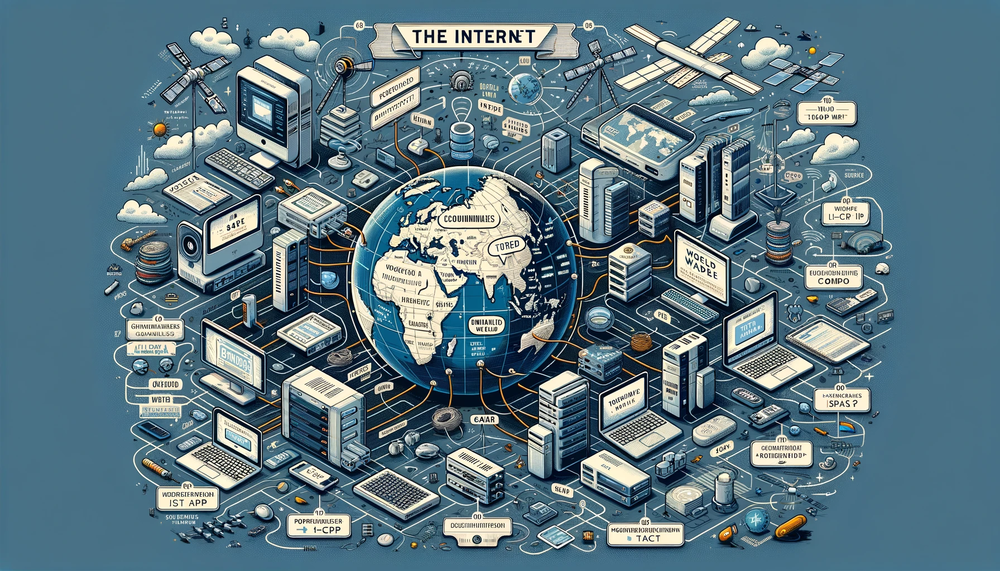

# Internet

Internet è una rete globale di computer interconnessi che permette la comunicazione e lo scambio di dati tra dispositivi di tutto il mondo. Questa rete è composta da una vasta infrastruttura di hardware e software, inclusi server, router, cavi e protocolli, che lavorano insieme per consentire la trasmissione di informazioni.

Ecco alcuni punti chiave per comprendere meglio cos'è Internet:

1. **Rete di Reti**: Internet è spesso descritta come una "rete di reti" perché collega milioni di reti private, pubbliche, accademiche, aziendali e governative, permettendo loro di comunicare tra loro.

2. **Protocolli di Comunicazione**: Internet utilizza una serie di protocolli di comunicazione standardizzati per permettere ai dispositivi di comunicare. Il più importante di questi è il protocollo IP (Internet Protocol), che indirizza e instrada i dati verso la loro destinazione. Altri protocolli fondamentali includono TCP (Transmission Control Protocol) e HTTP (HyperText Transfer Protocol).

3. **World Wide Web (WWW)**: Spesso confuso con Internet stesso, il World Wide Web è un servizio offerto attraverso Internet. È un sistema di documenti ipertestuali collegati tra loro, accessibili tramite browser web come Chrome, Firefox o Safari.

4. **Accesso a Informazioni e Servizi**: Internet fornisce accesso a una vasta gamma di informazioni e servizi, tra cui siti web, email, social media, streaming video, giochi online e molto altro. È una risorsa fondamentale per l'informazione, l'educazione, il lavoro e l'intrattenimento.

5. **Comunicazione Globale**: Internet ha rivoluzionato la comunicazione, rendendo possibile inviare messaggi istantanei, effettuare videochiamate e collaborare in tempo reale con persone in qualsiasi parte del mondo.

6. **Infrastruttura Fisica**: Nonostante spesso si pensi a Internet come a qualcosa di immateriale, essa si basa su un'infrastruttura fisica complessa che include cavi sottomarini, data center, satelliti e torri di comunicazione.

7. **Sicurezza e Privacy**: Con l'uso diffuso di Internet, la sicurezza e la privacy sono diventate preoccupazioni importanti. Tecnologie come la crittografia e le reti private virtuali (VPN) aiutano a proteggere i dati e la comunicazione online.

In sintesi, Internet è una componente essenziale della vita moderna, che collega persone, macchine e sistemi in un'unica, vasta rete globale.