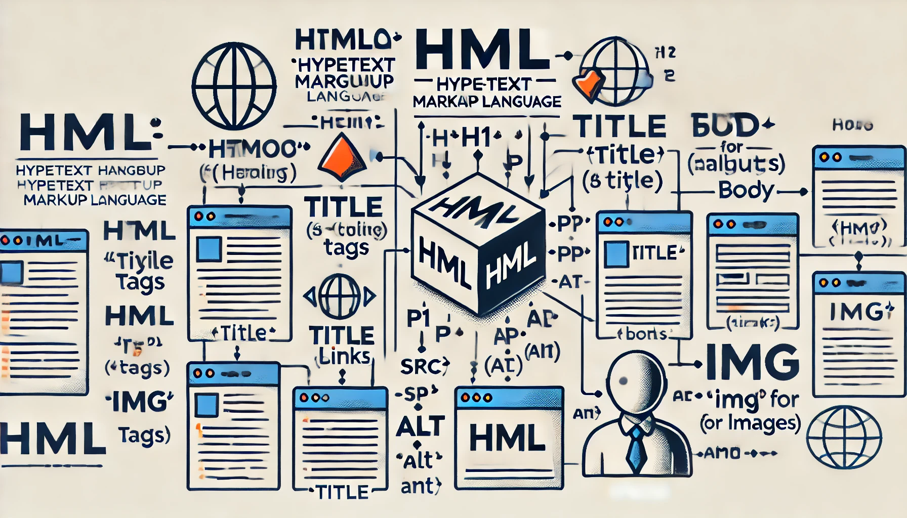

# HTML



HTML, acronimo di **HyperText Markup Language**, è il linguaggio di markup standard utilizzato per creare e strutturare le pagine web. Esso consente di definire la struttura di un documento web, organizzando il contenuto in elementi come titoli, paragrafi, immagini, link e altro ancora.

Ecco alcuni punti chiave per comprendere cos'è HTML:

1. **Linguaggio di Marcatura**: HTML utilizza dei "tag" per descrivere diversi elementi di una pagina web. Ogni tag indica al browser come visualizzare un particolare tipo di contenuto.

2. **Tag ed Elementi**: Un tag HTML è racchiuso tra parentesi angolari `< >`. I tag spesso vengono usati in coppia, con un tag di apertura `<tag>` e un tag di chiusura `</tag>`. Ad esempio, `<p>` definisce l'inizio di un paragrafo e `</p>` ne definisce la fine.

3. **Struttura di Base**: Una pagina HTML di base include un doctype, un elemento `<html>`, un `<head>` e un `<body>`. Ecco un esempio di base:
   ```html
   <!DOCTYPE html>
   <html>
   <head>
       <title>Pagina di esempio</title>
   </head>
   <body>
       <h1>Benvenuti</h1>
       <p>Questo è un paragrafo di esempio.</p>
   </body>
   </html>
   ```

4. **Attributi**: I tag HTML possono avere degli attributi che forniscono ulteriori informazioni sugli elementi. Gli attributi sono inclusi nel tag di apertura e hanno un valore. Ad esempio, `` include gli attributi `src` e `alt` per specificare la sorgente dell'immagine e una descrizione alternativa.

5. **Ipertesto**: HTML consente di creare collegamenti ipertestuali (link) tra diverse pagine web, facilitando la navigazione. I link vengono creati utilizzando il tag `<a>`, come in `<a href="pagina.html">Visita questa pagina</a>`.

6. **Compatibilità**: HTML è supportato da tutti i browser web, rendendolo un linguaggio universale per la creazione di contenuti web.

7. **Standard**: HTML è mantenuto e sviluppato dal World Wide Web Consortium (W3C) e da altre organizzazioni, che assicurano che il linguaggio evolva per soddisfare le nuove esigenze del web.

In sintesi, HTML è il fondamento di ogni pagina web, fornendo la struttura necessaria per visualizzare contenuti e interagire con essi attraverso il browser.