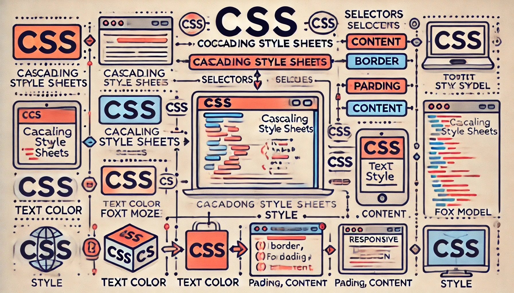

# CSS



CSS, acronimo di **Cascading Style Sheets**, è un linguaggio utilizzato per descrivere l'aspetto e il formato di un documento scritto in un linguaggio di markup come HTML. Mentre HTML fornisce la struttura del contenuto di una pagina web, CSS è responsabile della sua presentazione visiva, includendo layout, colori, font, e altri aspetti stilistici.

Ecco alcuni punti chiave per comprendere cos'è CSS:

1. **Stile e Layout**: CSS consente di separare il contenuto dalla presentazione. Utilizzando CSS, è possibile definire lo stile di vari elementi HTML, come titoli, paragrafi, link, tabelle e altro, senza modificare il contenuto stesso.

2. **Regole CSS**: Una regola CSS è composta da un selettore e da un blocco di dichiarazioni. Il selettore indica quale elemento HTML verrà stilizzato, mentre il blocco di dichiarazioni contiene una o più dichiarazioni di stile. Ogni dichiarazione consiste in una proprietà e un valore, separati da un due punti. Ad esempio:
   ```css
   p {
       color: blue;
       font-size: 16px;
   }
   ```
   In questo esempio, il selettore `p` applica le dichiarazioni di stile a tutti gli elementi `<p>`, rendendo il testo di colore blu e con una dimensione di 16px.

3. **Cascade e Specificità**: CSS segue il principio del "cascading" (cascata), il che significa che gli stili possono essere sovrascritti in base alla specificità e all'ordine delle dichiarazioni. Gli stili definiti più specificamente (ad esempio, tramite ID o classi) avranno priorità su quelli meno specifici.

4. **Selettori**: CSS offre una varietà di selettori per applicare stili a diversi elementi. Alcuni esempi includono selettori di tipo, selettori di classe, selettori ID e selettori attributo. Ad esempio:
   ```css
   #header {
       background-color: #f0f0f0;
   }
   .main-content {
       margin: 20px;
   }
   ```

5. **Box Model**: CSS utilizza il modello a scatola (box model) per rappresentare la struttura degli elementi HTML. Ogni elemento è rappresentato come una scatola rettangolare che comprende margine, bordo, padding e contenuto. Comprendere il box model è fondamentale per creare layout complessi.

6. **Responsive Design**: CSS consente di creare design responsivi che si adattano a diverse dimensioni di schermo e dispositivi. Media queries, unità relative (come `%` e `em`) e tecniche di layout flessibile (come Flexbox e Grid) sono strumenti comuni per il design responsivo.

7. **Framework e Preprocessor CSS**: Per facilitare lo sviluppo e mantenere il codice CSS pulito e organizzato, vengono spesso utilizzati framework CSS (come Bootstrap) e preprocessori CSS (come Sass e LESS). Questi strumenti offrono funzionalità avanzate e riducono la complessità del codice.

In sintesi, CSS è un linguaggio potente che permette di controllare l'aspetto visivo delle pagine web, rendendo possibile la creazione di design accattivanti e funzionali.