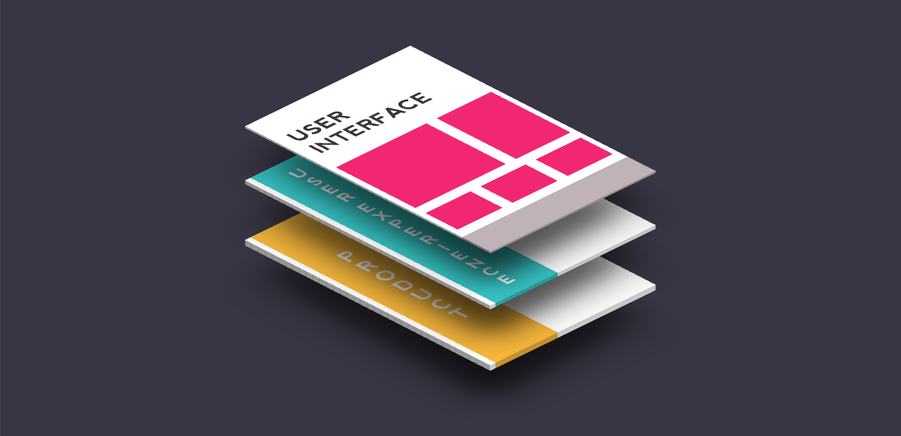

# 1 Introduzione

> *Introduzione alla guida pratica alla progettazione di interfacce web responsive, al fine di ottenere la massima esperienze utente.*

In questa guida scopriremo il mondo delle **Web User Interface** (o Web UI) responsive, passando attraverso i vari aspetti multidisciplinari: progettazione, disegno e sviluppo, con focus sul flusso di lavoro, gli strumenti ma anche i trend, i consigli e i design pattern del momento.

Nelle lezioni che compongono la guida, realizzeremo insieme un progetto in cui metteremo in pratica la conoscenza degli argomenti man mano affrontati.

La **User Interface Design** (che in italiano si traduce come "progettazione di interfacce utente") è una materia molto ampia che sfiora e si intreccia con moltissime altre discipline, ognuna delle quali richiede ulteriori approfondimenti. Quella che sta per iniziare non sarà una guida omnicomprensiva, quanto piuttosto uno strumento utile per sviluppatori e designer che desiderano avere una conoscenza più completa del contesto in cui lavorano, al fine di intervenire efficacemente nella creazione di un prodotto, sia in fase di design che di sviluppo.

> *Perchè uno sviluppatore dovrebbe preoccuparsi della progettazione della UI, o un designer della sua implementazione?*

In un panorama così complesso e mutevole, è sempre più importante informarsi e sapersi muovere in fretta e bene per essere competitivi.

Inoltre, il lavoro di designer e sviluppatori è sempre parte di un meccanismo più grande, un sistema, sia esso una pagina, un sito, un portale che sarà a sua volta solo una parte di un progetto multimediale più grande di advertising, prodotto o di brand identity, e così via.

Maggiore è la conoscenza multidisciplinare relativa ad un sistema, maggiori saranno le competenze e la disinvoltura e quindi la capacità di lavorare bene, collaborare con altre persone, creare un risultato di qualità e addirittura di innovare. E certamente tutto ciò ci aiuterà anche a trovare lavoro.

## Aree tematiche di competenza

Abbiamo capito come la UI design sia una materia collegata con molte altre, e che progettazione e realizzazione di un’interfaccia richiedono una conoscenza di queste altre aree. Chiariamo quindi quali sono queste materie, e soprattutto in cosa differiscono.

### UX vs UI design

La **differenza tra UX e UI** (acronimi che stanno rispettivamente per "user experience" e "user interface") non è sempre chiara, soprattutto per chi proviene dal mondo dello sviluppo: i due termini tendono ad essere sovrapposti e persino interscambiati. In questa sede non affronteremo tutte le differenze e i dettagli delle due aree, ma è importante capire il loro ruolo all’interno del ciclo di produzione di un prodotto. Semplificando:

- per **User Experience (UX)** si intende l’esperienza vissuta da una persona, l’utente, quando si relaziona ed interagisce con uno o più prodotti o servizi;
- la **User Interface (UI)** indica invece l’insieme di tutti gli elementi visivi che l’utente usa per interagire con un dispositivo. Nel nostro contesto ci occuperemo principalmente di una sottoclasse di UI, identificata come **GUI** (Graphic User Interface).

La UX indica quindi una sfera più ampia, un’esperienza appunto che include non solo componenti del prodotto ma anche componenti psicologiche, emotive e personali dell’utente suscitate dall’interazione col prodotto stesso. Una user experience positiva è memorabile e fidelizza l’utente verso il prodotto e spesso verso il brand.

**La UI, per certi versi, rientra all’interno della UX** nel momento in cui contribuisce fortemente a determinare l’esperienza “diretta” dell’utente. L’interaction design si occupa in maniera più specifica degli elementi interattivi e del comportamento dell’interfaccia a seguito di azioni dell’utente.

In sintesi, nell'ambito della UX si effettua molta ricerca, user testing, architetture delle informazioni e usabilità, oltre alle UI. La **UX include anche il processo di progettazione** dell’interfaccia attraverso wireframes (bozze o scheletri dell’interfaccia di un'applicazione o sistema) e prototipi (bozze interattive che simulano l’interazione dell’utente). In fase di definizione di *wireframes* e prototipi, l’interfaccia non è definita a livello grafico ma piuttosto sono definiti il layout (la struttura), la navigazione, i contenuti principali e gli hotspot (elementi interattivi). Lo UI designer normalmente si concentra principalmente sulla realizzazione dell’interfaccia e dei suoi elementi a livello grafico. A volte lo UX designer è sinonimo di UI designer se si occupa della creazione grafica dell’interfaccia.

### UI development

Normalmente chi si occupa di UX/UI design ha un background da “creativo”, legato alla comunicazione visiva e alla grafica in generale, magari non solo web.

Ad un certo punto arriva però il momento in cui dobbiamo rendere interattiva la nostra interfaccia, e per farlo (nel caso delle interfacce web) essa va sviluppata in HTML e Javascript, il linguaggio con cui il browser interpreta e renderizza le pagine web.

Lo sviluppo consiste nel produrre codice e nella maggior parte dei casi lo sviluppatore ha appunto un background completamente diverso e prettamente tecnico: ignora il mondo grafico, purtroppo sminuendo talvolta il lavoro dei designer.

Lo UI developer può essere quindi un designer passato dalla parte del codice o uno sviluppatore che si avvicina al mondo delle interfacce grafiche, magari perché incuriosito o semplicemente costretto per necessità.

È molto comune e tragicomico il fatto che il “grafico” non sia in grado di programmare e lo “sviluppatore” non sappia nulla di grafica: parlano lingue diverse ma entrambi necessitano l’uno dell’altro. Il classico dilemma **designer VS coder** porta ad incomprensioni e a volte ad insoddisfazione.

Proprio per risolvere questo dilemma è nata l’idea di questa guida. L’intento è quello di aiutare lo sviluppatore a capire e realizzare una semplice interfaccia grafica per un sito e al contempo aiutare il designer a realizzare con il codice ciò che lui stesso ha ideato. Per mettere online il sito, per quanto semplice, è necessario lo sviluppo e per questo motivo la guida dedica molto spazio anche alla parte di implementazione della UI che andremo a creare.

## Il progetto

Per conoscere e mettere in pratica le cose che abbiamo accennato finora, realizzeremo come progetto concreto un piccolo sito personale.

L’idea è quella di realizzare in maniera semplice un **portfolio** che può essere quindi utile e richiede effettivamente la conoscenza degli argomenti oggetto della guida.

Probabilmente la soluzione più semplice sarebbe comprare un template, con grafica e sviluppo HTML/CSS già fatto, ma senza produrre direttamente qualcosa è difficile acquisire le competenze necessarie per applicare il know-how in progetti futuri, sicuramente più grandi e retribuiti. Se è vero appunto che il progetto è su piccola scala, è vero pure che i concetti, il workflow, le best practices e i consigli del mestiere possono essere applicati anche su grande scala.

Questo progetto sarà sicuramente più confortevole in alcune fasi per i designer in altre per i developer, ma è proprio questo il nostro scopo: essere in grado di creare un’interfaccia grafica e svilupparla.

La realizzazione del progetto prevede tre fasi ben distinte:

1. la fase iniziale di **UX design**, in cui individueremo i contenuti principali, progetteremo la struttura e la navigazione del sito. In questa fase cominceremo ad individuare i design patterns e definire le interazioni di base dei componenti. Carta e matita saranno i nostri amici;
2. la fase di vera e propria di **UI design**, in cui definiremo lo stile di comunicazione, realizzeremo graficamente i componenti e creeremo la user interface. La nostra creatività e i software di image editing saranno i nostri amici;
3. la fase finale di **UI development**, ossia svilupperemo il sito e i suoi componenti come definiti nella fase di UI design. HTML e CSS saranno i nostri amici.