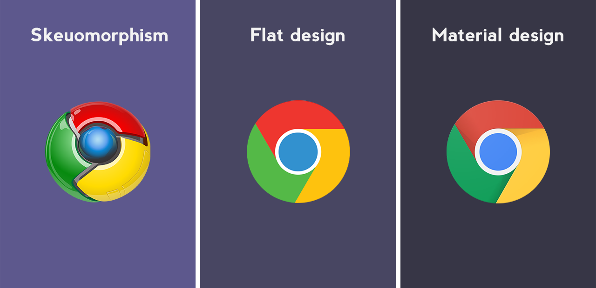

# 2. Scenario
> *Una panoramica sui principali concetti che hanno a che fare con il Responsive Web Design moderno: dai design pattern ai web trends.*

Link copiato negli appunti
Il contesto della creazione di interfacce utente e di esperienze di utilizzo è molto ricco, se non sovraffollato, di prodotti, input, tools, frameworks e anche mode del momento. Cerchiamo di fare un po’ di chiarezza.

## Tools & Frameworks vs Competenza e Esperienza

Il mondo open source ha contribuito alla generazione di numerose risorse per designer e sviluppatori, ma in questo caos è sempre più difficile scegliere quali strumenti usare e a volte è la qualità di ciò che facciamo a risentirne.

Anche se può sembrare scontato, uno dei criteri fondamentali per orientarci tra gli strumenti, senza farsi troppo condizionare dalle mode, è quello di analizzare le features che ci servono realmente per i nostri progetti, per evitare che manchino quelle necessarie o che ce ne siano troppe.

In realtà molti strumenti si equivalgono, l’importante è saperli usare nel modo giusto. Per questo, nella nostra cassetta degli attrezzi non dovrebbero mancare:

- professionalità
- competenza
- esperienza
- conoscenza del dominio

Sfatiamo il mito secondo cui i tool possono colmare **gap di conoscenza**: un professionista utilizza diversi strumenti a supporto della sua produttività, ma possiede tutto il know-how per sapere cosa deve fare e come a prescindere dallo strumento che usa.

Inoltre, usare i tool richiede un investimento di tempo, e in certi casi è meglio investire il tempo prima per acquisire delle competenze e poi per comprendere i tools.

Nel corso della guida saranno comunque indicati tools e risorse utili nelle varie fasi, ma vogliamo dare priorità al “come” realizzare il progetto piuttosto che a “cosa” usare.

## Web trends

I **web design trends** a livello di interfaccia e di stile grafico sono dettati dai grandi player del mercato in termini di brand e prodotti: Google, Apple, Microsoft, Spotify, ecc… Spesso sono i “big” a decidere le sorti delle mode sul web anche a livello grafico basico in termini di forme, colori e stile. Così il web è saturo di siti che si somigliano.

## Flat design, scheumorfismo e Material design

La crescente diffusione degli smartphones e la conseguente navigazione su browser mobile ha favorito il boom del **Flat design**: colori piatti, forme geometriche, icone, tipografia minimalista, ombre soppiantate da forme che simulano ombre allungate per alludere ad una terza dimensione, ma in maniera completamente lontana dal reale

Il tutto è reso possibile da HTML5, CSS3 e JS, che permettono una riproduzione via codice di qualunque elemento grafico, che un tempo sarebbe per forza stato un’immagine caricata come risorsa esterna del browser.

Per le sue caratteristiche il flat design nasce in risposta alle necessità del responsive web design.

Dicendo addio a sfumature, effetti elaborati, orpelli, grafiche pesanti e tentativi di riprodurre in maniera verosimile oggetti reali a favore di elementi piatti e forme geometriche, il flat design nasce in contrapposizione allo **scheumorfismo** che aveva dominato i decenni precedenti.

Ora che i software sono così potenti da poterci aiutare a riprodurre la realtà in modo realistico, ci concentriamo sulle possibilità del codice di realizzare la grafica in maniera interattiva e fruibile su diversi schermi.

Se il flat design risulta troppo piatto poiché toglie ogni ornamento grafico e rende interfacce ed elementi dei siti molto simili tra di loro, Google decide di partire da lì per creare il Material design, re-inserendo elementi scheumorfici come le ombre per indicare i livelli di profondità e definendo questo tipo di design attraverso guidelines specifiche e dettagliate.

Tra gli altri trends degli ultimi anni ci sono le **infografiche**, sorta di storytelling di informazioni o dati attraverso rappresentazioni grafiche.

## Responsive web design

I recenti design trends sono nati e si stanno evolvendo anche in funzione del cappello più grande del Responsive web design (RWD): l’insieme di tecniche per la progettazione e lo sviluppo di siti web responsivi, capaci quindi di adattarsi graficamente alle risoluzioni di schermi di diversi dispositivi (desktop, tablet, smartphone…).

Il web design tradizionale è ormai sparito ma anche se l’RWD è il nuovo standard, non tutti i siti ancora sono stati ri-progettati o progettati correttamente seguendo le best practices del design responsivo.

Fare il porting da un sito non responsive ad uno responsive non è immediato e spesso è necessario progettare il sito ex-novo. Tuttavia il passaggio si rende necessario sia per una questione culturale sia per l’ottimizzazione sui motori di ricerca (SEO) che tendono a penalizzare i siti che non sono responsive.

I dispositivi mobili hanno una serie di limiti. In primis, lo schermo e poi le condizioni in cui il prodotto viene fruito possono essere le più disparate, e per questo è fondamentale un approccio **Mobile first**, che metta in risalto i contenuti, faciliti la leggibilità dei testi e semplifichi drasticamente navigazione, organizzazione dei contenuti e, se presenti, flussi di acquisto.

L’impaginazione **pixel perfect** (che definisce posizione e dimensione di ogni elemento fino al singolo pixel) non è più possibile, o almeno non è più così utile poiché l’importante è la definizione del layout e del suo comportamento per le diverse risoluzioni identificate da “breakpoints”.

I **breakpoints** sono le risoluzioni di riferimento per cui l’interfaccia verrà progettata e sviluppata. Nelle tantissime risoluzioni tra un breakpoint e l’altro il sito dovrà scalare ed adattarsi in modo armonico allo schermo, sfruttando le percentuali e filtrando i contenuti in base alla loro reale importanza

Questo concetto rivoluziona il mondo della progettazione grafica: un designer non saprà mai esattamente come sarà vista la sua interfaccia grafica in termini di dimensioni, colori, ecc…

Scardinate le certezze grafiche del pixel, proporzioni, percentuali, omogeneità delle spaziature e ordinamenti avranno più importanza rispetto a colori, ornamenti, posizionamenti puntuali e relativi a punti precisi della **viewport** (area della pagina visibile dall’utente, legata alla risoluzione del device). A risoluzioni sempre incerte, anche il concetto di “above the fold” tende a vacillare. Per “**above the fold**” (letteralmente “sopra la piega”) si intende la porzione immediatamente visibile della pagina prima dello scroll da parte 

dell’utente.   

## UI design patterns e/o Web Components

Va molto di moda utilizzare la parola “pattern” riferito a qualunque argomento abbia a che fare con lo sviluppo, sia esso grafico o di codice. Ma cosa significa esattamente **UI design patterns**? Sono effettivamente dei patterns ossia degli schemi di elementi di UI, anche detti UI o UX patterns.

A fronte di alcune esigenze funzionali, di navigazione o di presentazione, esistono componenti già progettati da qualcuno talmente efficaci da essersi diffusi ed usati in molte applicazioni fino quasi a diventare uno standard implicito, elementi di uso comune.

Gli UI patterns sono l’applicazione di soluzioni trovate a problemi pratici, normalmente legati all’usabilità e/o a vincoli di vario tipo (risoluzione, condizioni di utilizzo, performances, ecc…).

Questi componenti includono un comportamento legato alla loro interazione con l’utente. È necessario individuare quali UI patterns sono necessari e funzionano nel nostro sito, quindi il contesto è fondamentale poiché uno UI pattern diffusissimo può non servire o non funzionare nel nostro contesto. Inoltre, l’interfaccia mette insieme più componenti che quindi devono funzionare anche a livello di sistema e non solo singolarmente.

Esempi di UI patterns possono essere:
- hambuger menu per la navigazione
- card layout
- navigazione a tab
- accordion
- long scroll
- scroll to
- immagini “hero”
- social sharing, ecc...

L’idea di pattern richiama il concetto di modularità che ben si sposa con l’approccio di sviluppo a componenti o widget web.

Un insieme di UI patterns dallo stesso aspetto (look & feel) si può definire come una **UI library o UI pattern library** che è appunto l’implementazione di questi componenti, disponibili in una pagina web di documentazione.

Gli UI patterns e la loro implementazione stabiliscono il legame diretto tra mondo UX e mondo sviluppo: data una funzionalità o un contenuto richiesto nel sito, lo UI pattern progettato dal designer indica allo sviluppatore come un elemento deve apparire visivamente e funzionare a livello di interazione.

## Conclusioni

Tutti i prodotti sul web hanno in comune un elemento: hanno un’interfaccia con cui l’utente si relaziona in maniera interattiva contribuendo a determinare la user experience. Un approccio olistico è molto importante per comprendere le interdipendenze e fare un lavoro di qualità pronto per essere lavorato ed evoluto nelle fasi successive per la creazione del prodotto. Oltre a comprendere bene le aree di intervento e quindi le competenze necessarie per lavorare nelle varie fasi è fondamentale conoscere lo scenario in cui ci si muove.

