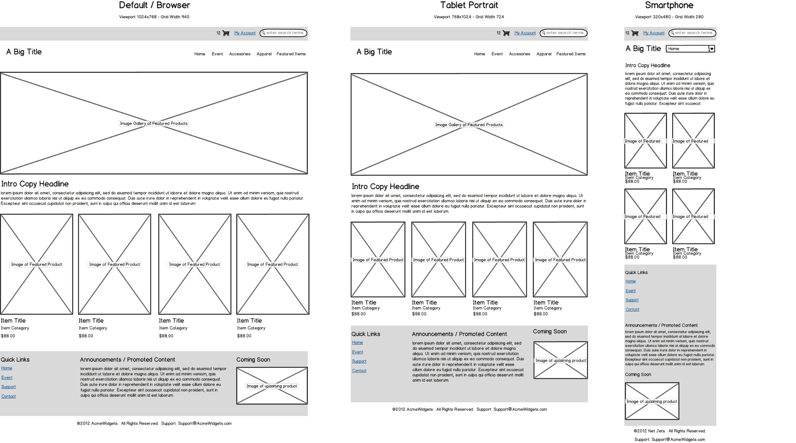

# 4 Strumenti per la UX

> _Una panoramica sui principali strumenti per la definizione di wireframe e prototipi, finalizzati alla progettazione di UI e UX di un'applicazione web._

Esistono molti strumenti per la UX, sia gratuiti e che a pagamento. A parte le
caratteristiche oggettive di ognuno di essi, la preferenza circa l'uso di questi strumenti è spesso una questione soggettiva.

Tutti gli strumenti digitali hanno alcune caratteristiche comuni:

- permettono di creare una schermata web che simuli l’interfaccia del
  prodotto finale, inserendo o disegnando componenti ed elementi di UI
  “abbozzati”;
- servono per creare le bozze della UI. Spesso si
  configurano come una sorta di librerie di oggetti basici, normalmente
  trascinabili, che fungono da placeholder (segnaposto) dei reali
  contenuti del sito, simulandone l’ingombro, la posizione e a volte
  il funzionamento nel caso di componenti interattivi;
- sono tipicamente semplici e intuitivi, poiché i file prodotti in
  questa fase non sono definitivi e devono essere modificati
  velocemente e facilmente.

In generale, si possono dividere questi tipi di tool in due categorie:

- quelli per la creazione di **wireframe** statici (normalmente
  esportati in immagini);
- quelli che gestiscono in maniera avanzata l’interattività e
  permettono la creazione di prototipi navigabili (fruibili come PDF
  o presentazioni online gestite dal software nativo).

Un’altra tassonomia dei tool si basa sul loro costo: gratuiti,
con licenza o abbonamento mensile. Esaminiamone alcuni.

## Carta e penna

L’approccio “Carta e penna” (o più spesso matita) è talvolta sottovalutato a
favore di strumenti digitali, ma ha alcuni vantaggi:

- azzera i tempi di apprendimento legati al software da utilizzare
  (dal momento che sappiamo già scrivere e disegnare);
- la realizzazione fisica della bozza avviene in pochi minuti;
- richiede strumenti a disposizione di tutti e a buon mercato;
- si può usare in qualunque ambiente, non richiede elettricità,
  connessione, PC, ecc..

Inoltre, poiché il focus è appunto il contenuto e non la forma, non sono
necessarie capacità artistiche particolarmente spiccate.

Finché si tratta di un progetto di dimensioni ridotte, personale o di un
piccolo team, è possibile condividere le bozze su carta tramite foto, via
chat o email.

Quando si lavora a progetti più complessi, di solito commerciali e/o in
ambito aziendale, è bene avere anche dei file che possano fungere da
documentazione e su cui si possa lavorare in maniera collaborativa senza
paura di perdere le proprie bozze.

Per questo motivo, dopo una rapida fase su carta per fissare le idee e i punti
principali, in genere si passa ad un **software di wireframing** per produrre
digitalmente le varie schermate.

## Wireframing: Balsamiq, Draw.io, Mockplus

Esistono molti software di wireframing, alcuni dei quali a pagamento.
Normalmente, le aziende utilizzano licenze apposite e scelgono un solo tool
per realizzazione di wireframe e simili.

La scelta del software è molto personale. In genere, per prodotti di piccola
e media dimensione sono sufficienti software gratuiti o con un costo molto
ridotto.

Valutiamo velocemente tre tra i più usati.

### Balsamiq

È, a ragione, uno dei software di wireframing più usati, per via della sua semplicità e
facilità con cui è possibile creare interfacce a bassa fedeltà, mediante l'uso di elementi
di UI tramite drag & drop. Nonostante si chiami Balsamiq Mockups, lo stile
degli elementi è volutamente minimal (sembrano disegnati a mano) per
agevolare la concentrazione sul layout principale e sulle funzionalità piuttosto
che sul visual design. È molto user friendly, e permette di raggiungere rapidamente
un buon livello di produttività, grazie anche alle molte funzionalità per la
collaborazione in team. Purtroppo non è gratuito, sebbene la licenza ha un
costo abbastanza accessibile ($89). È disponibile una versione di prova
gratuita della durata di 30 giorni.

### Draw.io

Si tratta di una web app completamente gratuita (non esiste una versione PRO) che si integra
con Google Drive, OneDrive e Dropbox, permettendo altresì di salvare i wireframe sul
proprio computer. Ha le funzionalità di base di un tool di wireframing, così come la
libreria di componenti pronti divisi per categoria, permettendo l’esportazione in
diversi formati. Purtroppo non permette di creare più pagine e non ha
elementi interattivi (hotspots), quindi non permette di effettuare test di
usabilità. Inoltre, è sempre necessaria una connessione ad internet per poterci
lavorare. Per essere un’applicazione web, è comunque un buono strumento se
ciò che si vuole sono solo wireframes statici.

### Mockplus

Mockplus è un’applicazione desktop per creare in modo veloce
wireframe e prototipi, elaborati per varie piattaforme (mobile, web e
desktop). Ha un’interfaccia pulita, è potente ed ha una curva di
apprendimento molto rapida.

Offre una vasta libreria di componenti e widget interattivi pronti e
aggiornati agli standard web contemporanei (pop-up panel, stack panel,
scroll box, ecc...) e, come Balsamiq, ripropone uno stile “sketch”, con
elementi disegnati a mano.

Il plus di questo tool è la possibilità di creare e collegare pagine e
componenti interattivi tramite drag & drop, di provarli immediatamente
con una preview sui dispositivi reali (tramite QR code) e di condividere il
progetto online tramite link.

È diventata popolare per il suo mix di funzionalità potenti e facilità di
utilizzo, insieme al fatto che ha anche una versione gratuita (con funzionalità
di base). Le sue potenti funzionalità legate alla parte di interaction design lo
rendono di fatto un tool ottimo anche per i prototipi lo-fi, oltre che per i
wireframes.

###
 Prototyping: Marvel, InVision, Axure

Il confine tra tool di wireframing e di prototipazione (o prototyping) è molto labile, e in
alcuni casi le due cose si sovrappongono. In ogni caso, il tool di
prototyping si concentra sull’interazione piuttosto che sulla progettazione
dell’interfaccia. In alcuni casi questi strumenti sono anche tool di
wireframing, ma possono risultare più complessi perché hanno funzionalità
aggiuntive necessarie per gestire anche il prototipo (che è ricco di
interazioni e si deve avvicinare maggiormente al prodotto finito). Anche in
questo caso esistono diversi strumenti, che hanno in comune il fatto di creare
schermate interattive senza che siano necessarie capacità di sviluppo di
codice.

Vediamo tre dei software più usati.

### Marvel

Marvel è una web app che permette di creare prototipi mobile e web in modo
semplicissimo.

È possibile importare diversi formati di immagini, tra cui anche Sketch e
Photoshop, gestendo la sincronizzazione su cloud. Non permette la creazione
di wireframe, di asset e di interazioni complesse, quanto piuttosto la gestione
di link per navigare tra le schermate (immagini) e il supporto a gesti e
transizioni.

Una funzionalità molto interessante è quella che consente di scegliere il
frame del prototipo per crearne diversi in base al dispositivo (smartphone,
iPad, desktop, Apple TV, Apple Watch e Android).

Esiste una versione gratuita che permette di creare al massimo due
progetti. Essa, tuttavia, non permette il download dei file, ma è comunque
possibile condividere in vari modi il lavoro per ricevere feedback. Le sue
funzionalità sono veramente basiche, quindi non è adatto a tutti i progetti ma
è facilissimo da usare, soprattutto per creare prototipi che
necessitano solo di navigazione tra diverse pagine.

### InVision

Anche InVision, come Marvel app, è una web app e nasce per realizzare
prototipi basati sulla navigazione tra diverse schermate tramite link
(hotspots), sebbene non sia uno strumento adatto per produrre wireframe. Sempre come
Marvel, permette di effettuare l'upload di immagini, integrando anche Sketch e
Photoshop. Mette a disposizione anche “TETHR”, uno UI kit proprietario di
InVision. I suoi punti di forza sono l’interfaccia pulita, la facilità di
utilizzo (drag & drop), la gestione multipiattaforma (desktop/web/mobile
+ touch), il controllo di versione, gli strumenti di condivisione e
quelli collaborativi. La toolbar in
basso che permette di accedere ai diversi “livelli” di gestione del
prototipo (Preview, Build, Comment, History mode e Configuration) risulta molto utile nella modifica della singola schermata.

Come Marvel, la versione gratuita non permette il download e consente di
creare al massimo un progetto. Le sue funzionalità permettono lo user test,
ma richiedono sempre dei mockup da cui partire per le varie schermate. Ha
più funzionalità rispetto a Marvel ma non possiamo caratteristiche avanzate per
l’interattività, che è limitata ad hotspot e timeout.

### Axure

Axure RP è il tool più usato a livello enterprise (esiste in due offerte, ma
sempre a pagamento). Basato su HTML, permette la creazione di prototipi
responsive (sebbene non abbia template dedicati) e la
gestione dei gesti su mobile. Ha tutte le funzionalità solide di un tool di
prototyping standard: animazioni/transizioni, online sharing del progetto
(su ambiente Axure Share), libreria di widget ed elementi di UI, permette
di creare asset e wireframe. Ma anche molte funzionalità avanzate:
interazioni data-driven, flow condizionali, contenuti dinamici e funzioni
matematiche.

Due i punti di forza: la flessibilità che permette di personalizzare i
componenti e l’interattività applicabile a singoli elementi che consente di
creare comportamenti di interazione complessi. Per realizzare prototipi ad
alta fedeltà è necessario importare dei mockup già fatti.

Axure è sicuramente un tool potente, di una categoria superiore rispetto a
Marvel e InVision. Proprio per questo, però, risulta molto più complesso e
sceglierlo significa investire molto più tempo nell’apprendimento del
software e nella creazione e gestione dei prototipi.