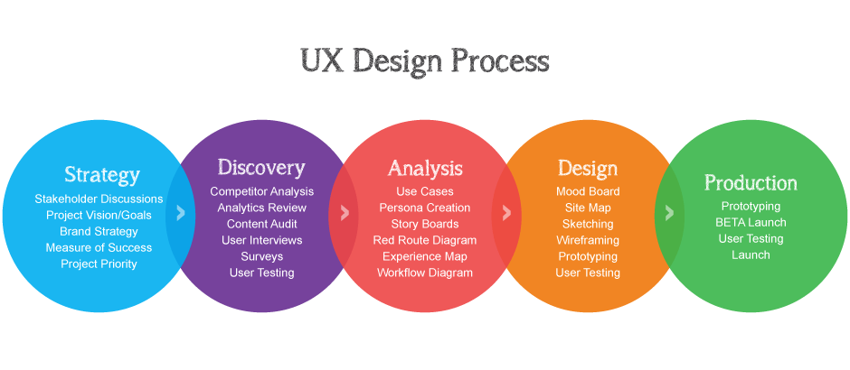
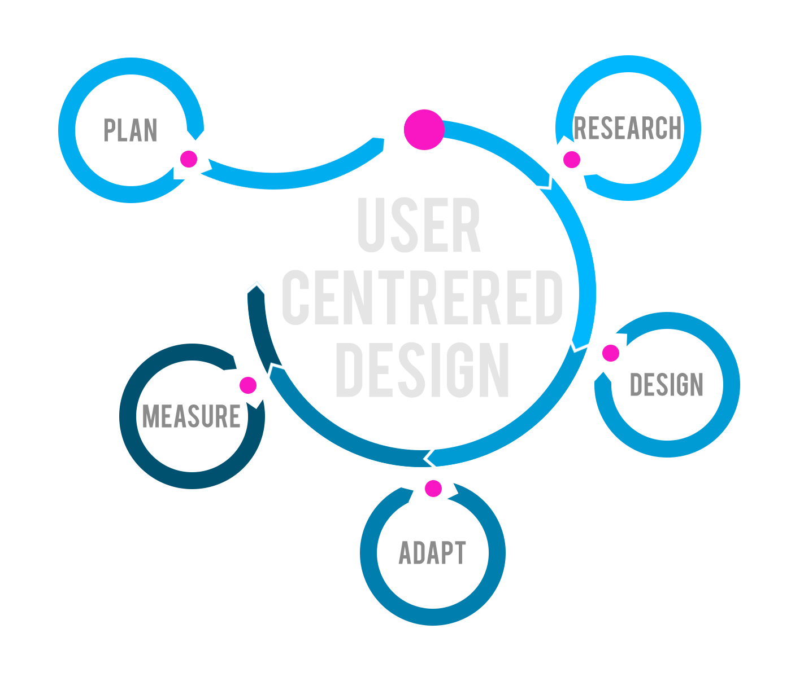
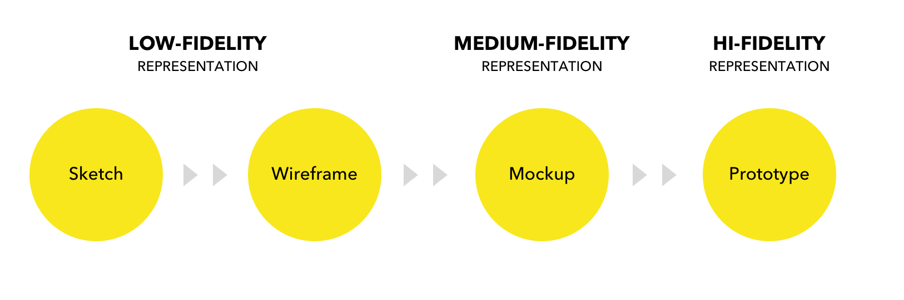

# 5 UX: il processo di design
>*Che cos'è il processo di design della user experience di un prodotto, e quali sono tutte le principali fasi che lo compongono.*

In quest'ultima lezione teorica, vedremo in cosa consiste il **processo di user experience design** e da quali fasi è composto per capirlo nel suo insieme. Ci soffermeremo poi sulla progettazione vera e propria, spiegandone la terminologia ed alcuni concetti che ci serviranno per cominciare la parte pratica del nostro progetto.

## Il processo di UX Design

Non esiste una definizione unica e standard di processo UX che vale per
tutti i progetti, ma piuttosto una serie di fasi che possono essere
reiterate durante tutto il ciclo di vita del prodotto al fine di
migliorarlo. Il processo può essere più rapido e snello per progetti
piccoli, in cui alcune fasi ed attività non sarebbero neanche praticabili
(lancio in Beta, interviste, personas, ecc…) o comunque avrebbero un costo
troppo elevato rispetto ai possibili benefici. Per avere un’idea più chiara
vediamo in cosa consistono le fasi del processo.

## Strategia

Come suggerisce il nome stesso, in questa fase si studia e si definisce la visione
strategica del prodotto, che normalmente rappresenta l’azienda o comunque
un brand ed implica una visione a lungo termine.

La strategia alla base di un progetto UX definisce il ruolo che il prodotto
deve avere all’interno dell’azienda stessa e del mercato, gli obiettivi
del prodotto e come verranno misurati i relativi risultati. In sintesi, è
una fase strategica finalizzata a capire **cosa si vuole da quel prodotto** e
**cosa deve rappresentare**.

Tipicamente questa fase non è in carico al team di UX (o almeno non del
tutto) ed avviene solo nelle grandi aziende e per prodotti che prevedono
investimenti ingenti e/o grandi numeri in termini di ricavi.

In progetti complessi, la strategia è però fondamentale per creare le linee
guida e gli input per le successive fasi del processo.

## Ricerca

Questa fase comprende tutte le attività di ricerca o di scoperta relative
al nostro progetto, che normalmente si concentrano sugli utenti e sui
competitor. In progetti molto complessi questa fase è significativa, mentre
per piccoli siti o prodotti viene saltata o resa essenziale.

L’**attività di ricerca** comporta una raccolta di dati a partire
dall’osservazione, da colloqui e questionari sottoposti agli utenti. I risultati di questa
fase sono molto importanti per l’ottimizzazione della UX.

## Analisi

In questa fase si analizzano i dati raccolti durante la ricerca o a
seguito di altre attività. Raccogliere,
organizzare e “capire” una serie di dati può aiutare a comprendere perché
una cosa funziona o meno, fornendo spunti utili ai designer per trovare o
migliorare alcune soluzioni. Per un prodotto nuovo, si definiscono gli
scenari e le caratteristiche del nostro prodotto.

## Design

La fase di design del processo UX serve per mostrare le idee agli utenti e
ricevere i loro feedback. Per farlo, si realizzano schizzi su carta,
wireframe, prototipi interattivi a bassa fedeltà per evitare che l’utente
si concentri sulla grafica, il brand o dettagli visivi. La progettazione
parte dalle informazioni raccolte nelle fasi precedenti e si concentra
sulla struttura, il layout e i macro-contenuti. È una fase collaborativa e
iterativa in cui non si presenta un prodotto finito ma piuttosto qualcosa
su cui lavorare insieme per cominciare a definire il progetto e rifinirlo
man mano.

## Produzione

In questa fase in si comincia ad implementare veramente il prodotto
con le sue caratteristiche e in accordo ai requisiti definiti nelle fasi precedenti.
Le attività consistono principalmente nello sviluppo tecnico e
di visual design, inclusi i relativi test.

È grazie a queste attività che le idee diventano il prodotto, ed è
interessante notare come anche profili tecnici come gli sviluppatori
partecipino (più o meno consapevolmente) al processo di User Experience.

Al termine di questa fase, i clienti/stakeholder e gli utenti vedranno una versione ad alta
fedeltà del prodotto, con grafica, contenuti, risorse e funzionalità reali.

## Applicare il processo di UX

Applicare questo processo in tutte le sue fasi è molto spesso difficile e
costoso in termini di tempo e risorse. Alcune fasi si sovrappongono e
difficilmente esistono figure così specializzate che si occupano di una
singola attività.

Il concetto principale, punto chiave delle metodologie *Agile*, è che il
processo UX deve essere:

- iterativo ed incrementale;
- user-centrico;
- basato sui feedback.

Proprio per questo si tende a “fare” piuttosto che analizzare oppure ad
usare strumenti che permettono di testare velocemente e raccogliere
feedback senza implementare e rilasciare in produzione la soluzione
alternativa (A/B testing).

## User-centered design

Una tipologia più specifica di processo che mette al primo posto l’utente
finale è lo **user-centered design (UCD)**.

Il processo UCD ripropone le fasi di progettazione e sviluppo
del ciclo di vita, ma con focus primario sulla comprensione profonda
di chi userà il prodotto e del suo contesto d’uso.

Non esiste una definizione unica del processo e delle sue attività, ma
piuttosto il concetto di individuare i bisogni dell’utente finale e di
soddisfarli.

Con questa metodologia, il design del prodotto viene sempre testato
dall’utente (presente durante tutte le fasi) e la validazione avviene
attraverso la verifica della sua soddisfazione.

Le forze che guidano lo sviluppo di un prodotto sono gli utenti reali e i
loro bisogni, non le tecnologie.

## UX design

In questa fase di progettazione si comincia ad essere “operativi”,
realizzando bozze in grado di visualizzare idee ed informazioni. Esistono
diverse terminologie per indicare queste bozze in base al loro grado di
fedeltà rispetto al prodotto “definitivo” (nel nostro caso, un sito web).

Esiste una sorta di workflow interno che porta un draft da bassa ad alta
fedeltà: sketch, wireframe, prototipo, mockup. Vediamo insieme i termini e
le loro differenze.

## Sketch

Letteralmente, indica uno schizzo su carta realizzato con penna o matita in
modo rapido ed approssimativo. Si può cambiare, cancellare, buttare e
rifare velocemente, e proprio per questo è efficace per fissare idee e
proposte segnando appunti, note e dubbi. La loro realizzazione è a costo
zero. Lo sketching si può considerare una parte della fase di wireframing,
perchè uno sketch è la versione cartacea e spesso la base di partenza di un
wireframe.

## Wireframe

Il wireframe è un documento digitale che rappresenta lo scheletro di un
sito.

Il termine indica nello sviluppo di grafica 3D un “modello in fil di
ferro”, quindi la **struttura** di un oggetto, privo di texture e tutti gli
elementi decorativi. Questa versione a bassissima fedeltà del design
(spesso bianco e nero) si concentra sui macro-contenuti, l’organizzazione
delle informazioni e come l’utente interagisce con l’interfaccia. La sua
**essenzialità visiva** permette di concentrarsi sull’**usabilità** e la
**funzionalità** ed è per questo uno strumento molto utile, soprattutto nel
design di un prodotto nuovo e di *major features*.

Funge da documentazione e facilita la comunicazione (raccolta e scambio di
feedback).

## Prototipo

Il prototipo è la **rappresentazione da media ad alta fedeltà** del prodotto
che permette di simulare l’interazione dell’utente con l’interfaccia. C’è chi sovrappone
il termine con con quello di wireframe interattivo, ma il prototipo è più
dettagliato e si avvicina maggiormente al prodotto finale, sia in termini
di aspetto visuale (non è una bozza in bianco e nero) che di interazione. Il suo
focus è quindi l’**interattività** ed **abilità allo user-testing**. Prototipi iper
dettagliati (sia graficamente che con gestione di micro interazioni)
possono essere molto simili al progetto finale, in questo caso per
realizzarli sono necessari dei mockups da importare a cui viene “solo”
aggiunta l’interazione.

Questa attività può avere un costo elevato e quindi non sempre è necessario
o conveniente farla.

## Mockup

Il mockup è il prototipo grafico dell’interfaccia dell’applicazione, in
pratica il visual design o la “grafica”. Mostra contenuti e struttura
definiti nei wireframes ma si concentra sull’aspetto visuale del prodotto
introducendo aspetti grafici legati a stile, colori, forme, distribuzione
degli spazi, ecc…

I mockup sono, per definizione, ad **alta fedeltà**: si realizzano con software
di image editing e vengono esportati in immagini che rappresentano le
schermate statiche del sito. L’approvazione dei mockups da parte degli
stakeholders permette l’inizio dello sviluppo tecnico.

La creazione dei mockup rientra già nella sfera di **UI design** vera e
propria e quindi all’interno della **fase di produzione della UX** e non più di
progettazione.