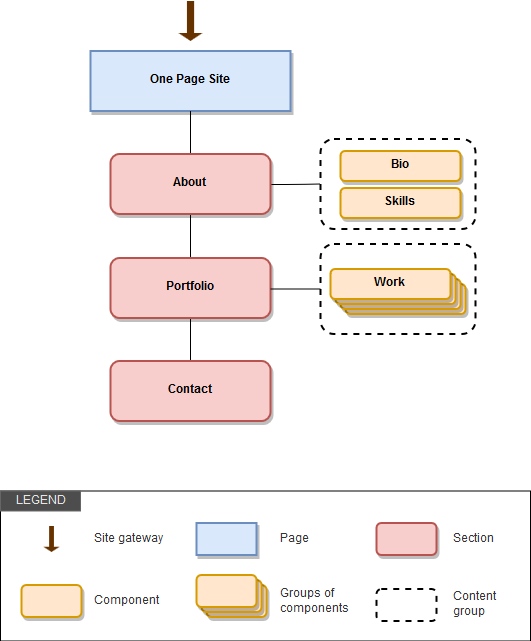

# 9 Sitemap, flowchart e layout
> *Imparare ad usare sitemap e flowchart, due strumenti fondamentali per la progettazione di un sito web, a cui è poi necessario assegnare un layout opportuno.*

Ora che abbiamo individuato i contenuti principali, pensiamo alla macro struttura del sito e alla sua navigazione. Creeremo un’organizzazione logica di massima e decideremo il layout principale.

Innanzitutto, decidiamo come organizzare i nostri contenuti all’interno di pagine o sezioni del sito e come renderli raggiungibili dall’utente.

## Pagine e sezioni

Data la natura del nostro portfolio, abbiamo scelto di fare un sito one-page, cioè interamente contenuto in una singola pagina. Il fatto che il sito sia “one-page” non significa che non abbia una sua struttura, una mappa.

Normalmente, la pagina di un sito web è di tipo tematico, ossia raccoglie le informazioni pertinenti una certa area. Nel nostro caso esiste sempre questa divisione tematica legata ai diversi tipi di contenuti, ma le pagine corrisponderanno alle diverse sezioni del nostro sito one-page.

e sezioni, come le pagine, non corrispondono ai componenti, ma si occupano solo di organizzare tematicamente i contenuti costituendo quindi il primo livello di accesso.

Per individuare le sezioni, basta organizzare in macro aree i contenuti che abbiamo definito nelle lezioni precedenti:

- “Intro/Splash” in cui ci presentiamo, col nostro nome, logo e headline (breve descrizione). In un sito normale con più pagine, potrebbe corrispondere a parte della Home Page
- “About” (“Su di me”) in cui mostriamo informazioni su di noi:
    - Breve biografia
    - Link a CV
    - Elenco capacità
- “Portfolio”, showcase dei nostri lavori come web designer
- “Contact” (“Contatti”), in cui forniamo informazioni e modalità per consentire agli utenti di mettersi in contatto con noi

## Navigazione

Normalmente in un sito one-page si utilizza come sistema di navigazione lo “Scroll To” verso le diverse sezioni. Una barra di navigazione contiene i link principali di tipo “ancora”, che puntano alle relative sezioni. Poiché la Splash ha uno scopo introduttivo, più legato all’impatto visivo che al contenuto, normalmente non viene resa raggiungibile dai link principali, ma solo dal link sul logo o sull’eventuale “back to top”. Quinidi, considerando solo le sezioni principali, il menu principale avrà i seguenti link:

- “About”
- “Portfolio”
- “Contact”

Oltre alla navigazione principale, potranno esistere altri livelli di navigazione sia di tipo interno (link su logo e back to top, link ipertestuali a contenuti ed altre ancore) che “esterno” (link ai social, indirizzo email, link ad altri siti).

In siti complessi esistono menù di navigazione di diversi livelli (primario, secondario, ecc…) e componenti di navigazione (breadcrumb, tabs, ecc…).

## Sitemap e Flow chart

Due strumenti utili per individuare e visualizzare il sistema di navigazione di un sito sono le sitemap e i flowchart.

**La sitemap elenca gerarchicamente tutte le pagine di un sito** e ne rappresenta la struttura e la navigazione.

La sitemap può essere una pagina web, ma anche una sitemap visuale che riproduce l’alberatura del sito.

Il **flow chart** (diagramma di flusso), indica più genericamente un diagramma a blocchi che **rappresenta visivamente il flusso di esecuzione di procedure o istruzioni**. Il flow chart di un sito può rappresentare in modo schematico non solo le schermate ma anche i flussi di navigazione condizionale che legano diverse pagine e componenti.

I flow chart sono particolarmente indicati per rappresentare flussi di navigazione necessari per eseguire specifiche operazioni.

## Layout

In questo paragrafo definiremo un layout di massima del nostro portfolio.

Non ha senso ora definire i dettagli perchè non è in questo momento che disegneremo la UI, ci concentreremo piuttosto su come organizzare i contenuti in blocchi all’interno della pagina, definendo il layout. La sistemazione degli elementi avviene utilizzando un sistema a griglia e le sue colonne.

## Layout di pagina

Esistono diversi tipi di layout di pagina per i siti web, ecco i principali:

|Tipo|Descrizione|
|---|---|
|**Layout a larghezza fissa**|il contenitore del sito e le colonne della sua griglia hanno una larghezza fissa espressa in pixel|
|**Layout fluidi (o liquidi)**|il contenitore e le colonne hanno larghezze in **percentuale**|
|**Layout elastici**|contenitore e griglia utilizzano gli em come unità di misura, rendendo tutto il layout scalabile in base al font|
|**Layout ibridi**|utilizzano contemporaneamente diverse unità di misura sfruttando i vantaggi dei tipi di layout precedenti|

I layout fissi sono più semplici da implementare e danno maggiore controllo ai designer, ma in ottica responsive gli altri tipi sono più adatti perchè sono in grado di adattarsi allo schermo in base allo spazio disponibile. Quest’ultimo ovviamente dipende dalla risoluzione e varia molto tra i diversi tipi di dispositivo (mobile, tablet e desktop).

Poiché il nostro sito dovrà essere responsive, creeremo un **layout ibrido in percentuale** (fluido) impostando però una **larghezza massima per desktop** (max-width fissa per il contenitore).

## Layout a griglia

Per ottenere un **layout fluido responsive** sfruttiamo una griglia con colonne di diverse larghezze definite in percentuale.

Un **sistema a griglia (o grid system)** si basa su un numero (modulo) e definisce non solo il numero massimo e minimo di colonne ma anche le spaziature, ossia i margini (gutter) tra le colonne stesse all’interno del contenitore. Un esempio classico è il sistema griglia di Bootstrap con base 12 colonne.

Un grid system definisce anche il **comportamento che devono avere le diverse colonne in base alla viewport**.

Il concetto di griglia responsive è l'“evoluzione web” dalla griglia di layout usata per l’impaginazione cartacea per posizionare gli elementi all’interno della pagina.

Il nostro sito avrà una struttura principale molto semplice a una colonna.

## Layout modulare

Una caratteristica chiave dei grid system è la **modularità**: non solo si possono definire colonne che sfruttano un dato numero di moduli ma questi moduli si possono usare anche all’interno di una colonna per definire un altro blocco di layout con colonne e così via.

La modularità del layout e il **nesting** (annidamento) permettono grande flessibilità, scalabilità e coerenza nell’organizzazione degli spazi.

La **scalabilità** della griglia permette di ri-arrangiare i contenuti così organizzati in maniera ottimale ed omogenea rispetto alle diverse risoluzioni.

Anche se il layout principale della nostra pagina è monocolonna, occorre definire dei layout interni ad hoc per le sezioni e i vari componenti. Vedremo come utilizzare le colonne della griglia per sistemare i contenuti, sfruttare al meglio gli spazi e capire come “scalare” il layout per i diversi dispositivi.

