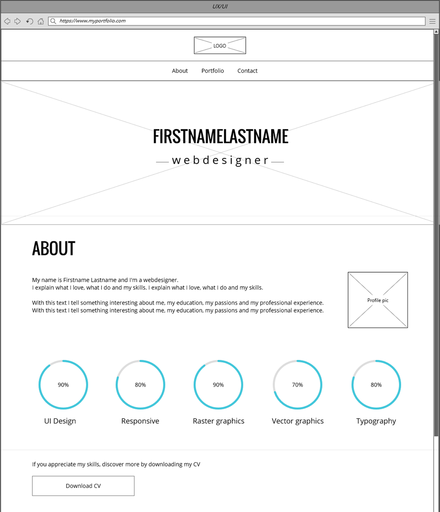
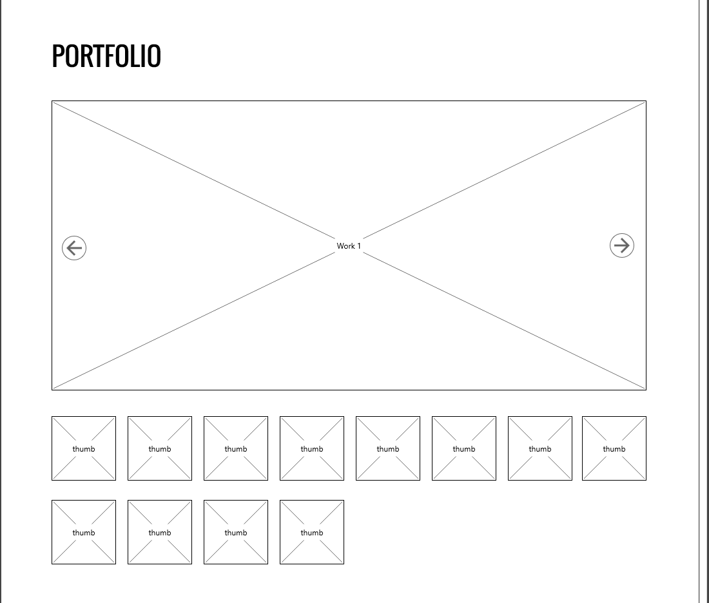
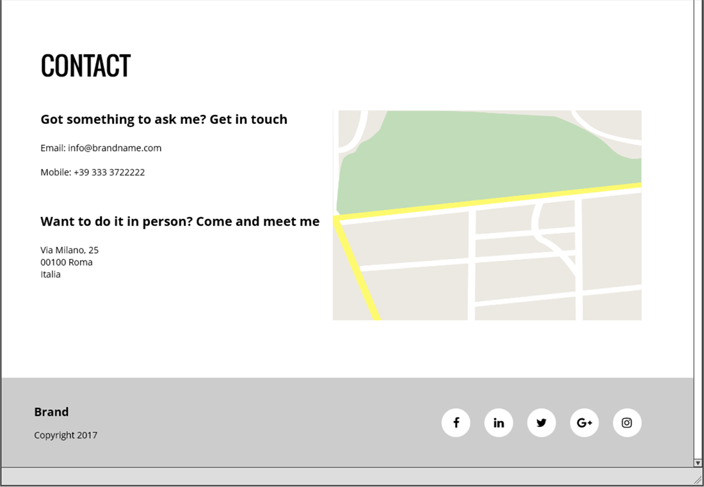
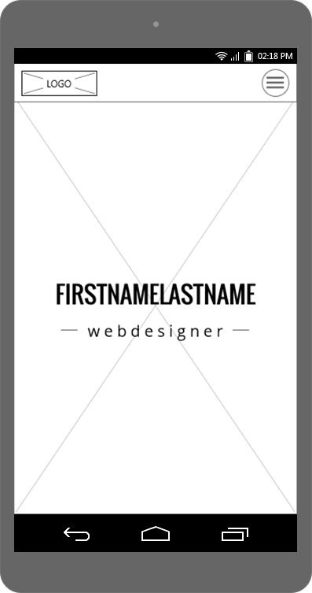
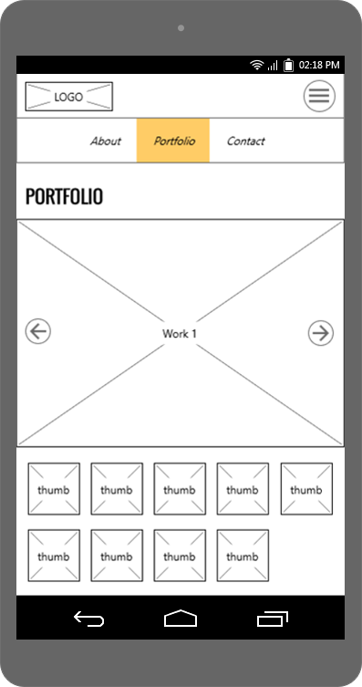
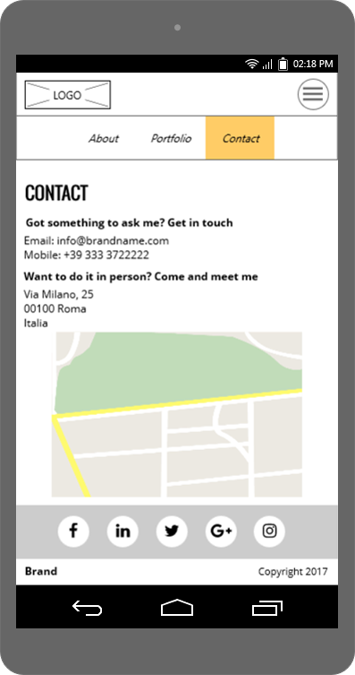
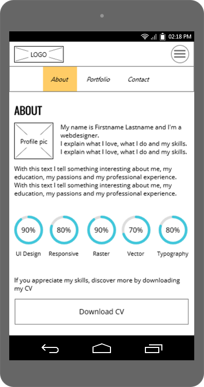

# Creare i wireframes
> *I wireframe, statici o interattivi, sono strumenti fondamentali nel design di interfacce web, permettendo di valutare l'usabilità della nostra applicazione.*

In questo capitolo creeremo i wireframes del nostro sito a partire dall’organizzazione stabilita. Per farlo, individueremo i componenti da organizzare nell’interfaccia e i design pattern che possiamo sfruttare. Passeremo poi alla parte visuale creando la bozza del layout per le schermate del sito.

## Componenti di pagina

Ora che sappiamo quale tipo di layout utilizzare, per creare i wireframes dobbiamo posizionare ed organizzare al suo interno i vari componenti, che altro non sono che blocchi di contenuto. Anche in questo caso un approccio modulare è utile per effettuare questa operazione. Individuiamo i moduli per la nostra pagina:

- Header
- Menu di navigazione (hamburger menu per mobile)
- Sezione intro
- Sezione “chi sono” (bio + skillset)
- Sezione portfolio (slider con lavori)
- Sezione contatti
- Footer (social + copyright)

## Ordinamento

Il **posizionamento degli elementi sarà orientativo e non preciso**, perché lo scopo dei wireframes è definire la struttura dando risalto a contenuti e usabilità piuttosto che all’aspetto visuale dell’interfaccia.

Se il focus è dunque la “lettura” veloce dell’interfaccia e la sua comprensione da parte dell’utente, **gli ordinamenti sono importanti**. Cosa va presentato all’utente prima di altro? Dove va posizionato un componente? Non importa a quanti pixel di distanza, ma importa il dove rispetto ad altri componenti della pagina.

Ordinamento e posizionamento di massima corretti servono all’utente per raggiungere velocemente e facilmente le informazioni che cerca. **Per rendere fruibile un prodotto, l’organizzazione logica si deve riflettere nell’interfaccia**.

Per questo, esistono degli ordinamenti ormai considerati standard, perché facilitano la lettura della pagina web e riflettono in qualche modo il processo mentale dell’utente. Tipicamente, si tratta di una lettura dall’alto in basso o da sinistra a destra (nel mondo occidentale). Ad esempio, si tende a mettere il menù principale in alto o in posizione evidente per permettere all’utente di navigare facilmente tra le pagine/sezioni. A livello di sezioni, è normale mostrare prima la presentazione piuttosto che i singoli lavori o le informazioni di contatto.

È vero che questa standardizzazione appiattisce molto l’aspetto dei siti, ma nel nostro caso stiamo imparando a creare interfacce web e quindi sfrutteremo ordinamenti standard “provati”. Solo con esperienza e padronanza di alcune pratiche del web design è possibile poi trovare soluzioni originali ma altrettanto efficaci, sempre in base allo specifico contesto.

## Design pattern

Abbiamo accennato in una lezione precedente cosa sono i **design pattern**. In senso lato, anche un certo tipo di ordinamento standard può essere considerato un macro design pattern.

Per facilitarci la vita, capiamo subito alcuni design pattern che possiamo sfruttare nel nostro portfolio:

- **Long scroll**: abbiamo scelto un sito one page con scroll verticale, quindi sfrutteremo un design pattern molto diffuso negli ultimi anni
- **ScrollTo**: questo pattern è complementare al “Long scroll”, poiché permette di raggiungere facilmente le varie sezioni “ancorate” ai link di navigazione
- **Back to top**: a completamento del trio del pacchetto “one page”, questo pattern permette di tornare in un attimo ad inizio pagina a prescindere dalla lunghezza dello scroll effettuato.
- **Hamburger menu**: su mobile, il menu di navigazione principale sarà un hamburger menu, con un tasto che “toggla” (attiva/disattiva) la visibilità dei link di navigazione. Ormai diventato di uso comune, questo pattern permette di sfruttare al meglio gli spazi ridotti degli schermi di dispositivi mobili.
- **Responsive carousel**: i carousel responsive permettono di mostrare immagini di prodotti/lavori in modo efficace ed accattivante. I vari framework e plugin hanno reso facilissima l’implementazione di questi slideshow anche per dispositivi touch.
- **Animated graphs**: molto in voga negli ultimi anni, i grafici animati sfruttano le capacità di animazione di CSS/Javascript per rendere accattivanti anche i dati di tipo numerico. Questo pattern è fondamentale per l’implementazione visuale del Data driven design.

## Wireframes

Dopo aver buttato giù le idee principali su carta (sketch), apriamo uno dei software per wireframing e creiamo digitalmente i wireframes del nostro sito.

Qui sotto possiamo vedere il wireframe one page realizzato con MockPlus.

Per comodità, è stato diviso in sezioni.

## Wireframes mobile

Ora che abbiamo un’idea orientativa dello scheletro e del layout del nostro sito, possiamo declinare il wireframe per mobile. Questa pratica opzionale richiede un po’ di tempo in più, ma è molto utile poiché permette di evidenziare subito eventuali criticità, normalmente legato allo spazio disponibile.

In ottica responsive, adattare gli stessi contenuti per risoluzioni minori comporta l’adattamento del layout con diverse colonne della griglia e l’eventuale ri-arrangiamento di alcuni contenuti, così come uno scaling delle immagini (larghezza responsive in percentuale).

Vediamo sotto la versione mobile del wireframe, diviso sempre per comodità in sezioni.

## Interaction Design ed Usabilità

Finora ci siamo concentrati sulla bozza del sito come rappresentazione visuale statica dell’interfaccia. Introduciamo ora brevemente alcuni concetti legati alla interattività tipica di un prodotto digitale.

## Wireframes interattivi

Come abbiamo anticipato, dopo aver prodotto i wireframes statici andrebbero prodotti i **prototipi**. Lo scopo è quello di evidenziare e definire le interazioni tra l’utente e l’interfaccia e il loro impatto.

Nel nostro caso l’interazione esiste solo per componenti interattivi per antonomasia quali i bottoni e i link (navigazione, social, thumbnails del portfolio, email, eventuale back to top) ed il loro comportamento è standard. Non sono previste interazioni complesse né un vero e proprio flusso lato utente.

Per questo, piuttosto che creare i prototipi, ci limitiamo a creare un wireframe interattivo che mostra unicamente il funzionamento dell’hamburger menu su mobile per mostrare/nascondere il menu principale.

Il wireframe interattivo ha un grado di fedeltà minore dell’interfaccia rispetto al prototipo. Al contrario di quest’ultimo infatti, per essere realizzato non necessita di mockups.

Il costo dei prototipi è mediamente alto ed è quindi consigliato per progetti più grandi in cui sono necessari la creazione di flussi complessi guidati dalla user interaction e l’approvazione da parte di clienti/stakeholders.

Wireframes interattivi e prototipi sono strumenti utilizzati per l’Interaction Design.

## Interaction Design

L’**Interaction Design è la progettazione dell’interazione tra l’uomo e i sistemi informatici**. Nel caso di un prodotto digitale si progetta l’interazione tra l’utente finale ed il prodotto fruibile tramite l’interfaccia

L’Interaction Design quindi è una disciplina che appartiene all'ambito dell'Interazione Uomo-Macchina (o Human-Computer Interaction, HCI) e si applica alla sfera UX. Creare sistemi interattivi godibili ed esteticamente piacevoli contribuisce a qualificare l’esperienza d’uso ossia come gli utenti vivono l’interazione col sistema.

Il focus è sul **comportamento e le modalità di interazione ossia sugli aspetti dinamici dell’interfaccia che riflettono un cambio del sistema**. Questo può avvenire come risultato di azioni dell’utente ma anche per cambiamenti interni al sistema stesso (posizioni, azioni, cambi di stato, errori, ecc…).

Il **sistema deve comunicare all’utente cosa succede attraverso gli elementi dell’interfaccia**. Uno degli obiettivi principali infatti è proprio quello di rendere i sistemi/prodotti usabili dagli utenti per cui sono stati realizzati.

## Usabilità

L'usabilità è definita dall'ISO, come l'efficacia, l'efficienza e la soddisfazione con le quali determinati utenti raggiungono determinati obiettivi in determinati contesti. In pratica definisce il grado di facilità e soddisfazione con cui si compie l'interazione tra l'uomo e uno strumento

Sono fondamentali quindi nel processo di progettazione dell’interazione i principi di usabilità:

- Efficienza
- Efficacia
- Soddisfazione
- Facilità di apprendimento
- Facilità di memorizzazione
- Sicurezza

Per quanto questi principi siano misurabili, l’usabilità non riferisce ad una caratteristica precisa identificabile nel prodotto ma piuttosto al risultato della combinazione tra diversi fattori quali utenti, prodotto e scopi.

Il tipico dilemma nella definizione dell’usabilità di un prodotto sta nel **gap tra il modello pensato e progettato dal designer e quello atteso dall’utente finale**. Un prodotto è tanto più usabile quanto più si avvicina all’idea dell’utente finale.

Molto spesso capita di progettare interfacce pensando saranno utilizzate in un determinato modo, ma solo una volta messe a disposizione degli end user scopriamo che il loro utilizzo è completamente diverso dal nostro e da quello che ci aspettavamo.

Proprio per questo è importante **sfruttare strumenti come i wireframes interattivi e/o i prototipi per condurre user tests** in grado di fornirci informazioni sull’utilizzo e le aspettative di chi userà il nostro prodotto.