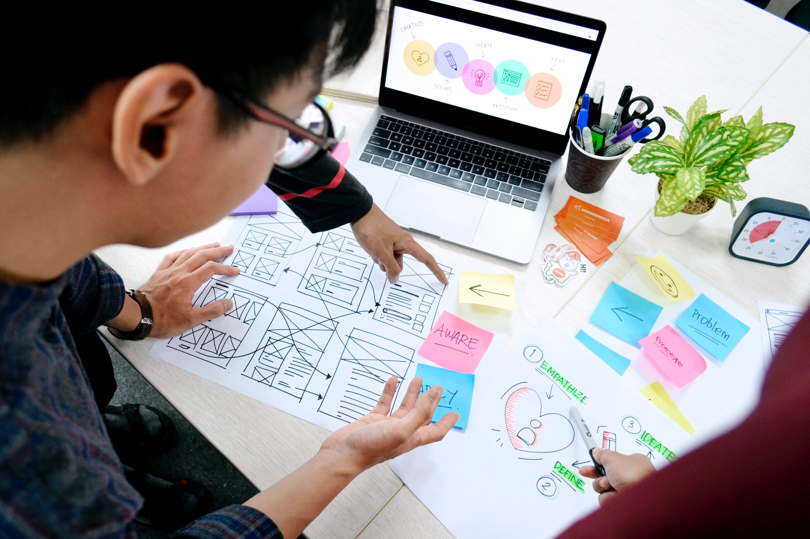
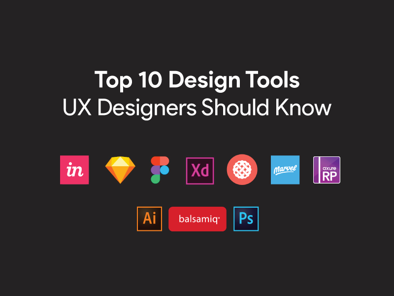

# UX design - Fondamentals



## Ux Thinking

### Cos'è la User Experience?

***User experience design (UXD)** is the process of
improving factors such as utility, ease of use, and
efficiency in a user’s interaction with a product or
service.*

### Cos'è lo Ux Design?

A **UX designer** analyzes, develops, wireframes,
prototypes, tests, iterates, and refines a product to
best **meet business goals and user needs**.

### Confusione tra i ruoli

- UX Designer
- Interaction Designer
- UI Designer
- Front-End Designer
- Digital Designer
- Digital Art Director
- User Research Specialist

## Ux tools



- User Research
- User Personas
- IA & User Flows
- Wireframing & Prototyping
- User Testing

## Processo UX

### Design Thinking

*“Design thinking is a human-centered approach
to innovation that draws from the designer’s toolkit
to integrate the needs of people, the possibilities
of technology, and the requirements for business
success.”*

```js
EMPATHISE -> DEFINE -> IDEATE -> PROTOTYPE -> TEST
                       |<-   User Interface    ->|
```

#### EMPATHISE

- Intervista Stakeholder
- Competitor Analysis
- UX Research

#### DEFINE

- Concept
- Specifications

#### IDEATE

- Customer Journey
- User Flows /Sitemap
- Wireframing

#### PROTOTYPE

- Prototyping

#### TEST

- User Testing

### Lean Ux

```js
THINK - MAKE - CHECK
  |______________|                   
```